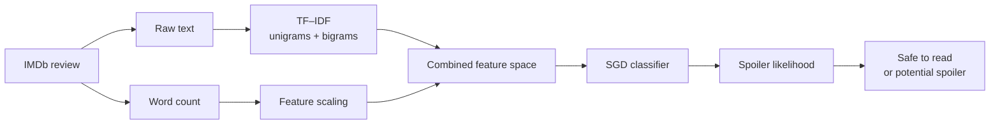
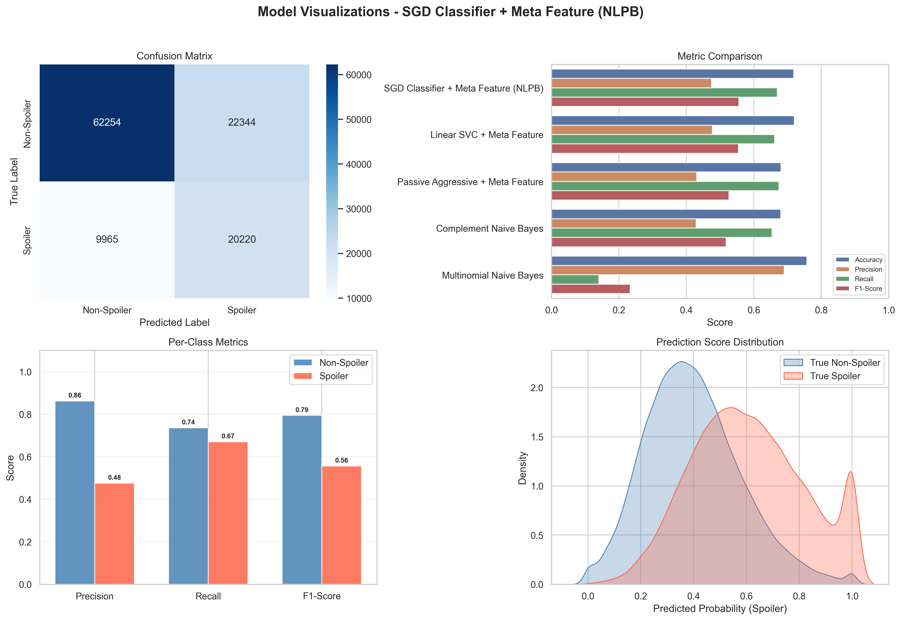

<div align="center">

# PlotGuard

### An NLP-powered movie spoiler detector

Paste an IMDb-style review and estimate whether it reveals important plot details before you read it.

[Open the live app](https://imdb-spoiler-detection-nlp.streamlit.app/) · [Explore the training notebook](./imdb-spoiler-detection.ipynb) · [View the dataset](https://www.kaggle.com/datasets/rmisra/imdb-spoiler-dataset)

</div>

## Overview

PlotGuard is an end-to-end natural language processing project that classifies movie reviews as `spoiler` or `non-spoiler`. It combines TF–IDF text features with review length and serves the trained classifier through a polished Streamlit interface.

The project covers the complete applied ML workflow:

- exploratory data analysis on the IMDb Spoiler Dataset
- feature engineering for review text and word count
- comparison of five lightweight classification algorithms
- model selection based on spoiler-class F1-score
- serialized inference pipeline for consistent preprocessing
- interactive, portfolio-ready web application

## Product experience

The Streamlit app is designed around a simple decision: is this review safe to read?

- Paste any English-language movie review
- Load safe and spoiler examples for a quick demonstration
- See the estimated spoiler likelihood and a clear recommendation
- Inspect the active model, decision threshold, and input length
- Read an honest limitation notice for ambiguous predictions

## How it works



The saved scikit-learn pipeline keeps preprocessing and inference together. The app creates the same `review_text` and `word_count` feature schema used during training, then retrieves the spoiler probability with `predict_proba`.

## Model performance

The dataset retains its original class imbalance: approximately 74% non-spoiler reviews and 26% spoiler reviews. F1-score is the primary selection metric because the task requires a balance between detecting spoilers and limiting false alarms.

| Model | Accuracy | Precision | Recall | F1-score |
| --- | ---: | ---: | ---: | ---: |
| **SGD Classifier + Meta Feature** | **0.719** | **0.475** | **0.670** | **0.556** |
| Linear SVC + Meta Feature | 0.720 | 0.477 | 0.662 | 0.555 |
| Passive Aggressive + Meta Feature | 0.680 | 0.431 | 0.675 | 0.526 |
| Complement Naive Bayes | 0.680 | 0.429 | 0.654 | 0.518 |
| Multinomial Naive Bayes | 0.757 | 0.690 | 0.141 | 0.234 |



These results make the trade-off visible: the selected model finds about 67% of spoiler reviews, but it also produces false positives. PlotGuard therefore presents its result as an experimental likelihood estimate rather than a guarantee.

## Technology

| Area | Tools |
| --- | --- |
| Interface | Streamlit |
| Data | pandas, NumPy |
| NLP | scikit-learn TF–IDF |
| Modeling | SGD, Linear SVC, Passive Aggressive, Naive Bayes |
| Visualization | Matplotlib, Seaborn |
| Dataset access | Kaggle API |
| Serialization | joblib |

## Repository structure

```text
.
├── .streamlit/
│   └── config.toml                 # Application theme
├── figures/
│   └── best_model_visualization.png
├── models/
│   ├── best_model_name.pkl
│   ├── model_comparison_results.pkl
│   └── spoiler_detection_pipeline.pkl
├── app.py                          # Streamlit application and inference logic
├── imdb-spoiler-detection.ipynb    # EDA, training, evaluation, and export
├── tests/
│   └── test_app.py                 # Saved-model integration checks
├── README.md
└── requirements.txt
```

The raw dataset is intentionally excluded from Git because it can be downloaded again from Kaggle.

## Run locally

Python 3.11 is recommended because it matches the environment used for the saved model.

```bash
git clone https://github.com/LecyLecy/imdb-spoiler-detection-nlp.git
cd imdb-spoiler-detection-nlp

py -3.11 -m venv .venv
.venv\Scripts\activate
python -m pip install --upgrade pip
python -m pip install -r requirements.txt
streamlit run app.py
```

Open `http://localhost:8501` if Streamlit does not launch a browser automatically.

Run the model integration checks with:

```bash
python -m unittest discover -s tests -v
```

## Reproduce the training workflow

1. Create a Kaggle API token from your Kaggle account settings.
2. Copy `.env.example` to `.env`.
3. Add your credentials:

```env
KAGGLE_USERNAME=your_kaggle_username
KAGGLE_KEY=your_kaggle_key
```

4. Open `imdb-spoiler-detection.ipynb` with the Python 3.11 environment.
5. Run the cells in order to download the data, perform EDA, train the candidates, and export the selected pipeline.

The notebook uses the full [IMDb Spoiler Dataset](https://www.kaggle.com/datasets/rmisra/imdb-spoiler-dataset), with `review_text` as the main input and `is_spoiler` as the target.

## Limitations

- The classifier is trained on English IMDb reviews.
- Very short, sarcastic, or context-dependent reviews can be misclassified.
- The original class imbalance increases the risk of false-positive spoiler warnings.
- The 50% threshold is a product default, not a universal safety boundary.
- Predictions indicate language patterns, not an understanding of a specific movie’s canon.

## Future improvements

- tune the threshold against a product-specific cost function
- add model calibration and confidence reliability analysis
- compare the linear baseline with transformer embeddings
- include per-title context to distinguish known plot details from general language
- add deployment health checks

## Data and attribution

This project uses the [IMDb Spoiler Dataset](https://www.kaggle.com/datasets/rmisra/imdb-spoiler-dataset) published on Kaggle. Refer to the dataset page for its source terms and attribution requirements.
